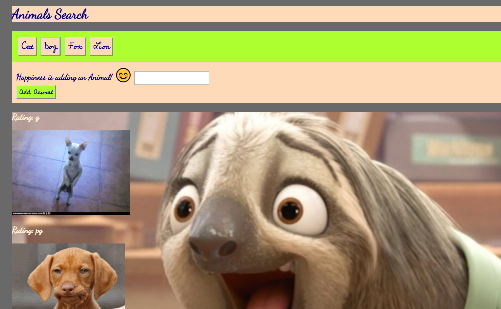

# Giftastic Animal Love
## Overview

This is a front end app that uses GIPHY API to make a dynamic web page that populates gifs of user choice.JSON and jQuery logic has been used along with AJAX and GIPHY API.This app has valid HTML and stylish CSS.
When the user clicks on a button, the page grabs 10 static, non-animated gif images from the GIPHY API and place them on the page.

## Instructions
* In this app, the user can add the button of favourite animal by writing name of animal on text area. 
* When clicked on add animal button, the animal name button will be added to the screen .
* The user can display 10 still giphy images by clicking on the animal button just added on the screen. 
* When the user clicks one of the still GIPHY images, the gif animates. If the user clicks the gif again, it stops playing.
* This is a lot of fun and excitement!!! So lets get started and click the link below: 

https://sharmap1.github.io/Giftastic/.

## Motivation
Animals bring happiness all around and so does it to my family and friends.I wanted to create an app that was challenging with logical thinking, yet fun. This was a huge learning and experience which I shared with my friends and family as well.
 
## Screenshot
 

## Installation
```
Git - Installing Git: Run git from terminal

git clone git://github.com/sharmap1/Giftastic.git bash

```
## Usage
```
Launch project from any code editor i.e. Sublime, Atom, VS Code, etc.

Open app in any supported web browser i.e. Chrome, Firefox, Safari, etc.
```
## Technologies used
* GIPHY API
* JavaScript
* jQuery
* AJAX
* JSON


## Contributing

* Pull requests are welcome. For major changes, please open an issue first 
to discuss what you would like to change.


## History
```
This marks the end of unit 6 where we have learned JavaScript & jQuery 
fundamentals, as well as touched on timing events, and giphy images.
```
## Credits
```
The Coding Bootcamp @ University of Washington

Instructor: Joel Stedman & TA s : Nick Aaland, Austin Williams 
```

## License
[MIT](https://choosealicense.com/licenses/mit/)

## Copyright
Copyright (c) [2019] [Prasamsha Sharma]
